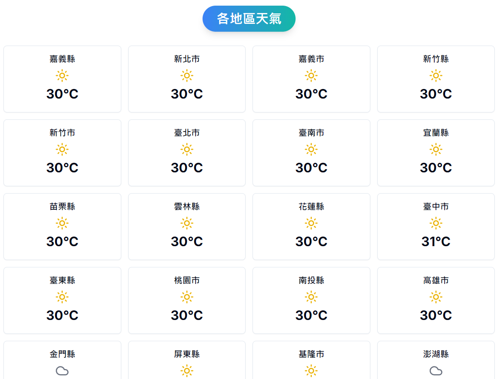
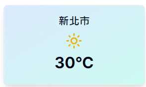

# Weather Dashboard

This is a weather dashboard that allows the user see the next 6 hours max temperature for Taiwan cities. Also, this project is made with Next.js with SSR (Server Side Rendering) and TailwindCSS.

## Demo

